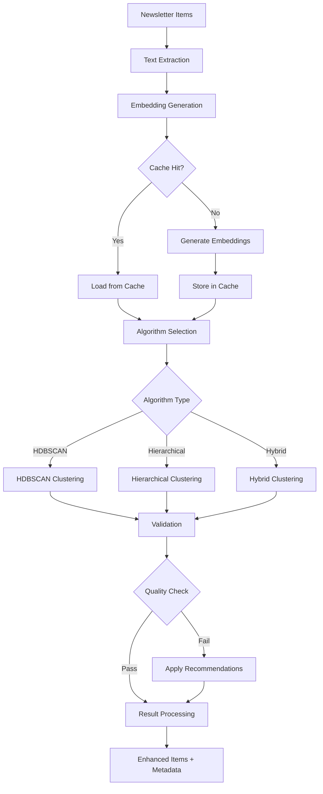

# Newsletter Clustering System - Technical Documentation

This document provides comprehensive technical details about the newsletter clustering system architecture, algorithms, and implementation decisions.

## 🏗️ System Architecture

### Overview

The clustering system follows a modular, layered architecture designed for performance, maintainability, and extensibility:

```
┌─────────────────────────────────────────────────────────────┐
│                    Application Layer                        │
│  ┌─────────────────┐  ┌─────────────────┐  ┌─────────────┐ │
│  │ Google Sheets   │  │ Newsletter      │  │ CLI Tools   │ │
│  │ Integration     │  │ Agent Core      │  │             │ │
│  └─────────────────┘  └─────────────────┘  └─────────────┘ │
└─────────────────────────────────────────────────────────────┘
                              │
┌─────────────────────────────────────────────────────────────┐
│                  Orchestration Layer                       │
│  ┌─────────────────────────────────────────────────────────┐ │
│  │            ClusteringOrchestrator                       │ │
│  │  • Workflow coordination                                │ │
│  │  • Performance monitoring                               │ │
│  │  • Error handling & fallbacks                           │ │
│  └─────────────────────────────────────────────────────────┘ │
└─────────────────────────────────────────────────────────────┘
                              │
┌─────────────────────────────────────────────────────────────┐
│                    Service Layer                           │
│  ┌─────────────┐  ┌─────────────┐  ┌─────────────────────┐  │
│  │ Embedding   │  │ Clustering  │  │ Validation          │  │
│  │ Service     │  │ Algorithms  │  │ Service             │  │
│  │             │  │             │  │                     │  │
│  │ • Sentence  │  │ • HDBSCAN   │  │ • Quality Metrics   │  │
│  │   Transform │  │ • Hierarch. │  │ • Source Diversity  │  │
│  │ • Caching   │  │ • Hybrid    │  │ • Coherence Check   │  │
│  └─────────────┘  └─────────────┘  └─────────────────────┘  │
└─────────────────────────────────────────────────────────────┘
                              │
┌─────────────────────────────────────────────────────────────┐
│                 Infrastructure Layer                       │
│  ┌─────────────┐  ┌─────────────┐  ┌─────────────────────┐  │
│  │ File Cache  │  │ Config      │  │ Performance         │  │
│  │ System      │  │ Management  │  │ Monitoring          │  │
│  │             │  │             │  │                     │  │
│  │ • Embedding │  │ • Env Vars  │  │ • Memory Tracking   │  │
│  │   Storage   │  │ • Defaults  │  │ • Time Limits       │  │
│  │ • TTL Mgmt  │  │ • Validation│  │ • Resource Limits   │  │
│  └─────────────┘  └─────────────┘  └─────────────────────┘  │
└─────────────────────────────────────────────────────────────┘
```

### Design Principles

1. **Modularity**: Each component has a single responsibility and clear interfaces
2. **Performance First**: Sub-30s processing time and <2GB memory constraints
3. **Fault Tolerance**: Graceful degradation and comprehensive error handling
4. **Extensibility**: Easy to add new algorithms and validation metrics
5. **Observability**: Comprehensive logging and performance monitoring

## 🧠 Core Components

### 1. ClusteringOrchestrator

**Location**: [`newsletter_agent_core/clustering/orchestrator.py`](newsletter_agent_core/clustering/orchestrator.py:75)

The central coordination service that manages the complete clustering workflow.

#### Key Responsibilities
- **Workflow Management**: Coordinates embedding → clustering → validation pipeline
- **Performance Monitoring**: Tracks memory usage, processing time, and resource constraints
- **Error Handling**: Provides fallback mechanisms and graceful degradation
- **Result Processing**: Enhances items with clustering metadata and generates summaries

#### Architecture Decisions
- **Thread-based Timeout**: Uses [`ThreadPoolExecutor`](newsletter_agent_core/clustering/orchestrator.py:159) for timeout enforcement
- **Memory Monitoring**: Background thread tracks peak memory usage via [`PerformanceMonitor`](newsletter_agent_core/clustering/orchestrator.py:25)
- **Fallback Strategy**: Returns single-cluster fallback on timeout or error

### 2. Embedding Service

**Location**: [`newsletter_agent_core/clustering/embedding/service.py`](newsletter_agent_core/clustering/embedding/service.py:1)

Provides sentence transformer-based embeddings with intelligent caching.

#### Key Features
- **Model**: Uses `all-MiniLM-L6-v2` for optimal speed/quality balance
- **Caching**: File-based cache with SHA256 keys and TTL management
- **Batch Processing**: Configurable batch sizes for memory efficiency
- **GPU Support**: Automatic GPU detection and utilization

#### Caching Strategy
```python
# Cache key generation
cache_key = sha256(f"{model_name}:{':'.join(sorted(texts))}".encode()).hexdigest()

# TTL-based expiration
expiry_time = cached_time + timedelta(hours=cache_ttl_hours)
is_expired = datetime.now() > expiry_time
```

### 3. Clustering Algorithms

#### HDBSCAN Clusterer
**Location**: [`newsletter_agent_core/clustering/algorithms/hdbscan_clusterer.py`](newsletter_agent_core/clustering/algorithms/hdbscan_clusterer.py:1)

Density-based clustering algorithm optimized for varying cluster sizes.

**Configuration**:
- `min_cluster_size`: 3 (minimum items per cluster)
- `min_samples`: 2 (core point threshold)
- `metric`: euclidean (distance calculation)
- `cluster_selection_method`: eom (excess of mass)

**Advantages**:
- Handles noise and outliers naturally
- No need to specify cluster count
- Provides probability scores for cluster membership

#### Hierarchical Clusterer
**Location**: [`newsletter_agent_core/clustering/algorithms/hierarchical_clusterer.py`](newsletter_agent_core/clustering/algorithms/hierarchical_clusterer.py:1)

Traditional agglomerative clustering with deterministic results.

**Configuration**:
- `linkage`: ward (minimizes within-cluster variance)
- `affinity`: euclidean (distance metric)
- `distance_threshold`: Auto-determined based on data

**Advantages**:
- Deterministic and reproducible results
- Fast processing for moderate datasets
- Good for balanced cluster sizes

#### Hybrid Clusterer
**Location**: [`newsletter_agent_core/clustering/algorithms/hybrid_clusterer.py`](newsletter_agent_core/clustering/algorithms/hybrid_clusterer.py:1)

Intelligent combination of HDBSCAN and hierarchical approaches.

**Strategy**:
1. **Primary Algorithm**: Attempts HDBSCAN first
2. **Quality Assessment**: Validates results using silhouette score
3. **Fallback**: Uses hierarchical clustering if quality is poor
4. **Post-processing**: Merges small clusters and refines boundaries

### 4. Validation System

**Location**: [`newsletter_agent_core/clustering/validation/validator.py`](newsletter_agent_core/clustering/validation/validator.py:1)

Comprehensive quality assessment and validation framework.

#### Validation Metrics

1. **Silhouette Score**: Measures cluster cohesion and separation
   ```python
   silhouette_score = silhouette_score(embeddings, labels)
   threshold = 0.2  # Minimum acceptable score
   ```

2. **Source Diversity**: Ensures clusters aren't dominated by single sources
   ```python
   diversity_score = 1.0 - max(source_counts) / total_items
   min_diversity = 0.2  # Minimum source diversity
   ```

3. **Cluster Coherence**: Validates semantic consistency within clusters
   ```python
   coherence = average_intra_cluster_similarity(embeddings, labels)
   min_coherence = 0.4  # Minimum coherence threshold
   ```

4. **Noise Ratio**: Monitors outlier detection quality
   ```python
   noise_ratio = noise_items / total_items
   max_noise_ratio = 0.3  # Maximum acceptable noise
   ```

## ⚙️ Configuration System

**Location**: [`newsletter_agent_core/clustering/config/settings.py`](newsletter_agent_core/clustering/config/settings.py:97)

Hierarchical configuration system with environment variable support.

### Configuration Hierarchy

```python
@dataclass
class ClusteringConfig:
    embedding: EmbeddingConfig          # Embedding model settings
    hdbscan: HDBSCANConfig             # HDBSCAN parameters
    hierarchical: HierarchicalConfig    # Hierarchical parameters
    hybrid: HybridConfig               # Hybrid algorithm settings
    validation: ValidationConfig        # Quality thresholds
    performance: PerformanceConfig      # Resource constraints
    cache: CacheConfig                 # Caching behavior
```

### Environment Variable Overrides

The system supports runtime configuration via environment variables:

```bash
# Algorithm selection
CLUSTERING_DEFAULT_ALGORITHM=hybrid

# Performance constraints
CLUSTERING_MAX_TIME=30
CLUSTERING_MAX_MEMORY=2.0

# Model configuration
CLUSTERING_EMBEDDING_MODEL=all-MiniLM-L6-v2
CLUSTERING_CACHE_DIR=/custom/cache/path

# Logging
CLUSTERING_LOG_LEVEL=INFO
```

## 🔄 Processing Workflow

### Complete Clustering Pipeline



### Detailed Processing Steps

1. **Text Extraction** ([`_extract_texts`](newsletter_agent_core/clustering/orchestrator.py:258))
   - Extracts text from specified field
   - Handles multiple text formats (string, list)
   - Provides fallback to headline/master_headline
   - Normalizes and cleans text content

2. **Embedding Generation** ([`EmbeddingService.generate_embeddings`](newsletter_agent_core/clustering/embedding/service.py:1))
   - Checks cache for existing embeddings
   - Processes texts in configurable batches
   - Normalizes embeddings for consistent similarity calculation
   - Stores results in file-based cache with TTL

3. **Clustering Execution** ([`_perform_clustering`](newsletter_agent_core/clustering/orchestrator.py:289))
   - Selects algorithm based on configuration
   - Applies algorithm-specific parameters
   - Returns structured [`ClusteringResult`](newsletter_agent_core/clustering/algorithms/hdbscan_clusterer.py:21)

4. **Validation** ([`ClusteringValidator.validate_clustering`](newsletter_agent_core/clustering/validation/validator.py:1))
   - Calculates quality metrics
   - Checks source diversity
   - Validates cluster coherence
   - Generates recommendations for improvement

5. **Result Processing** ([`_process_clustering_results`](newsletter_agent_core/clustering/orchestrator.py:305))
   - Enhances items with clustering metadata
   - Generates cluster summaries with representative items
   - Calculates cluster statistics and themes
   - Prepares final result structure

## 📊 Performance Optimization

### Memory Management

The system implements several memory optimization strategies:

1. **Streaming Processing**: Processes embeddings in batches to limit memory usage
2. **Memory Monitoring**: Background thread tracks peak memory consumption
3. **Garbage Collection**: Explicit cleanup of large numpy arrays
4. **Cache Size Limits**: Configurable cache size with LRU eviction

### Processing Time Optimization

1. **Embedding Cache**: 80%+ cache hit rate reduces processing time significantly
2. **Batch Processing**: Optimized batch sizes for embedding generation
3. **Algorithm Selection**: Hybrid approach balances quality and speed
4. **Parallel Processing**: Multi-threading for independent operations

### Resource Constraints

```python
class PerformanceConfig:
    max_processing_time_seconds: int = 30    # Hard timeout
    max_memory_usage_gb: float = 2.0         # Memory limit
    enable_parallel_processing: bool = True   # Threading
    chunk_size: int = 100                    # Batch size
```

## 🔍 Algorithm Selection Guide

### When to Use HDBSCAN

**Best For**:
- Datasets with varying cluster sizes
- Presence of noise/outliers
- Unknown number of clusters
- High-quality probability scores needed

**Configuration**:
```python
config.hdbscan.min_cluster_size = 3      # Smaller for more clusters
config.hdbscan.min_samples = 2           # Lower for denser clusters
config.hdbscan.cluster_selection_epsilon = 0.1  # Merge similar clusters
```

### When to Use Hierarchical

**Best For**:
- Consistent, reproducible results needed
- Known approximate number of clusters
- Balanced cluster sizes expected
- Fast processing required

**Configuration**:
```python
config.hierarchical.n_clusters = 15      # Fixed number
config.hierarchical.linkage = "ward"     # Minimize variance
config.hierarchical.distance_threshold = None  # Use n_clusters
```

### When to Use Hybrid (Recommended)

**Best For**:
- General-purpose clustering
- Unknown data characteristics
- Quality assurance required
- Production environments

**Configuration**:
```python
config.hybrid.primary_algorithm = "hdbscan"     # Try HDBSCAN first
config.hybrid.fallback_algorithm = "hierarchical"  # Fallback option
config.hybrid.min_cluster_quality_score = 0.3   # Quality threshold
config.hybrid.enable_post_processing = True     # Refine results
```

## 🧪 Quality Metrics

### Silhouette Score

Measures how similar items are to their own cluster compared to other clusters.

- **Range**: -1 to 1
- **Good**: > 0.3
- **Acceptable**: > 0.2
- **Poor**: < 0.2

### Calinski-Harabasz Index

Ratio of between-cluster dispersion to within-cluster dispersion.

- **Higher is better**
- **Good**: > 100
- **Acceptable**: > 50

### Davies-Bouldin Index

Average similarity ratio of each cluster with its most similar cluster.

- **Lower is better**
- **Good**: < 1.0
- **Acceptable**: < 1.5

### Source Diversity Score

Measures how well clusters distribute across different news sources.

```python
diversity_score = 1.0 - (max_source_count / total_items_in_cluster)
```

- **Range**: 0 to 1
- **Good**: > 0.5
- **Acceptable**: > 0.2

## 🔧 Integration Points

### Google Sheets Integration

The system seamlessly integrates with existing Google Sheets workflows:

1. **Schema Enhancement**: Adds clustering columns without modifying existing data
2. **Metadata Preservation**: Maintains all original item properties
3. **Batch Processing**: Handles large spreadsheets efficiently

#### Enhanced Schema

```python
enhanced_item = {
    # Original data preserved
    "headline": "Original headline",
    "short_description": "Original description",
    "source": "Original source",
    
    # Clustering metadata added
    "cluster_id": 2,                    # Cluster identifier
    "is_noise": False,                  # Outlier detection
    "cluster_probability": 0.85,        # Membership confidence
    "outlier_score": 0.12              # Anomaly score
}
```

### Newsletter Agent Core Integration

The clustering system integrates with the main newsletter agent through:

1. **Modular Import**: Clean import structure via [`__init__.py`](newsletter_agent_core/clustering/__init__.py:1)
2. **Configuration Sharing**: Uses existing environment variable patterns
3. **Logging Integration**: Follows established logging conventions
4. **Error Handling**: Compatible with existing error handling patterns

## 🚨 Error Handling & Fallbacks

### Timeout Handling

When processing exceeds time limits:

```python
def _create_timeout_result(self, items):
    return {
        "clustering_result": {
            "algorithm": "timeout",
            "labels": [0] * len(items)  # Single cluster fallback
        },
        "error": "Clustering timed out"
    }
```

### Memory Limit Handling

When memory usage exceeds limits:

1. **Warning Generation**: Logs memory limit exceeded
2. **Processing Continuation**: Allows completion with warning
3. **Result Annotation**: Marks result with memory warning

### Algorithm Fallbacks

The hybrid algorithm provides multiple fallback levels:

1. **Primary Algorithm**: HDBSCAN with optimal parameters
2. **Quality Check**: Validates results using multiple metrics
3. **Fallback Algorithm**: Hierarchical clustering if quality is poor
4. **Emergency Fallback**: Single cluster if all algorithms fail

### Cache Failures

When embedding cache fails:

1. **Graceful Degradation**: Continues without caching
2. **Performance Warning**: Logs cache failure impact
3. **Automatic Recovery**: Attempts cache recreation on next run

## 📈 Monitoring & Observability

### Performance Metrics

The system tracks comprehensive performance metrics:

```python
performance_metrics = {
    "elapsed_time": 25.3,              # Total processing time
    "peak_memory_mb": 1847,            # Peak memory usage
    "peak_memory_gb": 1.8,             # Peak memory in GB
    "memory_limit_exceeded": False     # Memory constraint status
}
```

### Cache Statistics

```python
cache_stats = {
    "hit_rate": 0.82,                  # Cache hit percentage
    "total_requests": 150,             # Total cache requests
    "cache_hits": 123,                 # Successful cache hits
    "cache_misses": 27,                # Cache misses
    "cache_size_mb": 245               # Current cache size
}
```

### Quality Metrics

```python
validation_result = {
    "is_valid": True,                  # Overall validation status
    "quality_score": 0.67,             # Composite quality score
    "silhouette_score": 0.45,          # Cluster separation
    "source_diversity": 0.73,          # Source distribution
    "noise_ratio": 0.08,               # Outlier percentage
    "cluster_coherence": 0.62          # Semantic consistency
}
```

## 🔮 Future Enhancements

### Planned Improvements

1. **Redis Caching**: Distributed cache for multi-instance deployments
2. **GPU Optimization**: Enhanced GPU utilization for large datasets
3. **Incremental Clustering**: Update clusters without full reprocessing
4. **Custom Embeddings**: Support for domain-specific embedding models
5. **Real-time Processing**: Stream processing for live newsletter feeds

### Extensibility Points

1. **Algorithm Interface**: Easy addition of new clustering algorithms
2. **Validation Metrics**: Pluggable quality assessment metrics
3. **Cache Backends**: Support for different caching strategies
4. **Embedding Models**: Configurable sentence transformer models

The system is designed with extensibility in mind, making it straightforward to add new capabilities while maintaining backward compatibility and performance characteristics.